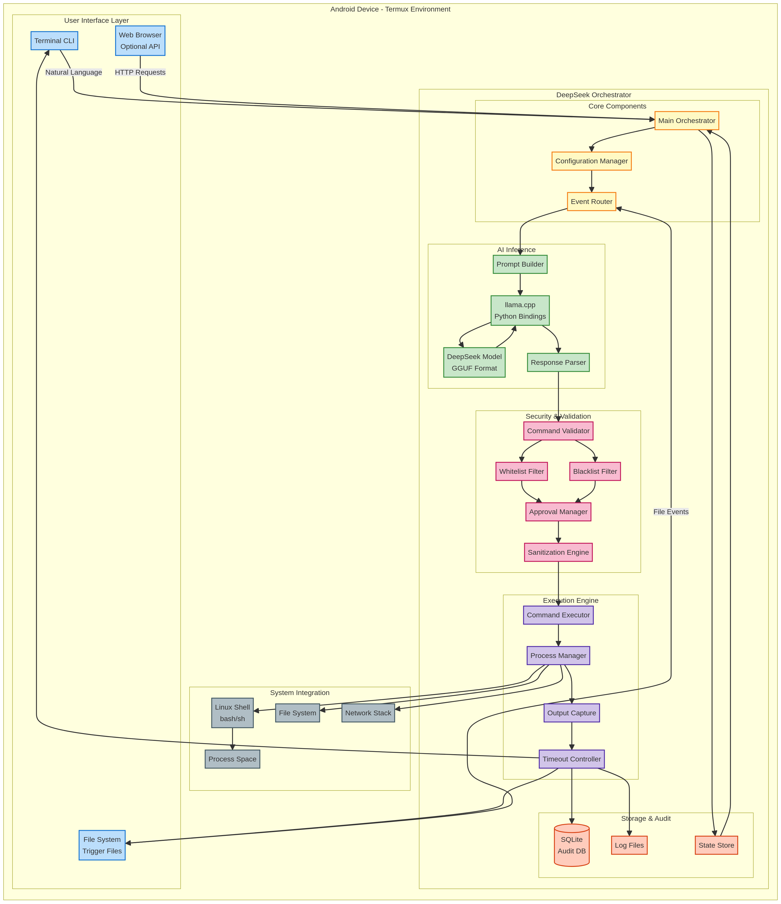

# DeepSeek Live System Orchestrator for Termux/Android

This project provides a ready-to-run solution for bridging a local DeepSeek language model to live system execution within a Termux environment on Android. It enables you to create a sovereign, offline AI agent that can safely interact with your device's command line based on natural language instructions.

## Overview

The orchestrator acts as a secure middleware that listens for triggers, uses a local language model to understand the intent, and executes the resulting commands after a rigorous validation and approval process. This turns your Android device into a powerful, programmable automation platform controlled by AI.

### Key Features

- **Local & Private**: All processing and inference happen entirely on your device. No data is sent to the cloud.
- **Multiple Trigger Sources**: Interact via an interactive CLI, trigger actions with files, or extend it with web APIs and scheduled tasks.
- **Robust Security Model**: Features a command whitelist/blacklist, user approval prompts for sensitive operations, and multiple execution modes (including a safe `dry-run` mode).
- **Comprehensive Auditing**: All actions, from suggestion to execution, are logged in a local SQLite database for full transparency and review.
- **Extensible Architecture**: Designed to be easily customized, with clear separation of components for inference, validation, and execution.
- **Mock Mode**: Can be run without a real language model for testing and development.

## System Architecture

The system is designed with a modular architecture to ensure security and flexibility. It consists of several key layers that process a request from its source to final execution.

### High-Level Workflow

The following diagram illustrates the general flow of a request through the orchestrator, from the initial trigger to the final execution and logging.


### Detailed Component Architecture

This diagram provides a more detailed look at the internal components of the orchestrator and how they interact within the Termux environment.



## Getting Started

Follow these steps to set up and run the DeepSeek Orchestrator on your Android device using Termux.

### Prerequisites

- **Termux**: Installed from F-Droid.
- **Sufficient Storage**: At least 4-8 GB of free space for the model and dependencies.
- **A GGUF Model File (Optional)**: A quantized language model compatible with `llama.cpp`. If you don't have one, the orchestrator will run in a mock mode.

### Installation

1.  **Clone or Download the Project**: Get all the project files onto your device inside the `~/deepseek_orchestration` directory.

2.  **Run the Setup Script**: Open Termux and execute the setup script. This will install all required packages and set up the necessary directory structure.

    ```bash
    bash ~/deepseek_orchestration/setup_termux.sh
    ```

    The script will prompt you to install `llama-cpp-python`. This step is optional but required for running a real model. It involves compiling native code and may take a significant amount of time.

### Configuration

1.  **Edit the Configuration File**: Open `~/deepseek_orchestration/config.json` with a text editor.

2.  **Set the Model Path**: If you have a GGUF model file, update the `model_path` to its absolute path on your device.

    ```json
    {
      "model_path": "/data/data/com.termux/files/home/models/deepseek-coder-6.7b-instruct.Q4_K_M.gguf",
      ...
    }
    ```

    If you leave `model_path` as `null` or the path is invalid, the orchestrator will start in **mock mode**, which provides pre-programmed responses for demonstration.

3.  **Review Security Settings**: The default configuration is set to `prompt` mode, which is the safest option. You can review the `whitelist`, `blacklist`, and `require_approval_for` lists to match your security needs.

## Usage

The orchestrator can be run in two primary modes: interactive CLI or file watcher.

### Interactive CLI Mode

This mode provides a command-line interface where you can type requests in natural language.

**To run:**

```bash
python ~/deepseek_orchestration/deepseek_orchestrator.py --mode cli
```

**Example:**

```
>>> List all text files in the home directory
DeepSeek suggested: find ~ -name "*.txt"
Approve execution? [y/n/v(view details)]: y

--- Output ---
/data/data/com.termux/files/home/test.txt
--- Completed in 0.21s ---
```

### File Watcher Mode

This mode monitors a directory (`~/deepseek_orchestration/triggers/` by default) for new files. When a `.task` or `.flag` file is created, the orchestrator reads its content as the prompt and processes it.

**To run:**

```bash
python ~/deepseek_orchestration/deepseek_orchestrator.py --mode watch
```

**Example:**

1.  In a separate Termux session, create a trigger file:

    ```bash
    echo "What is the current date and time?" > ~/deepseek_orchestration/triggers/get_time.task
    ```

2.  The orchestrator will detect the file, process the request, and (after your approval) execute the command.

3.  The output will be saved to `get_time.result`, and the original `get_time.task` file will be deleted.

### Execution Modes

The behavior of the execution engine is controlled by the `execution_mode` setting in `config.json`.

| Mode           | Description                                                                                             |
|----------------|---------------------------------------------------------------------------------------------------------|
| `prompt`       | **(Default & Safest)** Asks for user approval before executing any command.                               |
| `auto_approve` | Automatically executes commands that are on the `whitelist` and not on the `blacklist`. Still prompts for commands in the `require_approval_for` list. |
| `dry_run`      | Simulates execution. It shows what command *would* have been run but does not actually execute it.      |
| `audit_only`   | Logs the suggested command to the audit database but never executes it. Useful for monitoring suggestions. |

## Security

Security is a core design principle of this orchestrator. **Never run this system in a privileged or production environment without fully understanding the risks.**

- **Command Validation**: Every command is checked against a whitelist and a blacklist. This provides a first line of defense against dangerous commands.
- **User Approval**: By default, every action requires explicit user confirmation. This ensures you are always in control.
- **Sandboxing (Implicit)**: The orchestrator runs within the standard Termux environment, which is isolated from the main Android OS.
- **Audit Trail**: The SQLite database provides a complete, immutable record of every action taken, allowing you to review the agent's behavior.

## Extending the Orchestrator

The Python script is designed to be modular. You can extend its functionality by:

- **Adding New Trigger Sources**: Integrate with the Termux API to react to notifications or SMS messages.
- **Customizing the System Prompt**: Modify the `system_prompt` in the `process_request` function to change the AI's persona or specialize its expertise (e.g., focus on DevOps or creative writing).
- **Implementing a Web Interface**: Use Flask or FastAPI to create a web UI for interacting with the orchestrator, as shown in the `examples.md` file.

## Files Included

- `README.md`: This main documentation file.
- `deepseek_orchestrator.py`: The core Python script.
- `config.json`: The main configuration file.
- `setup_termux.sh`: The installation script for Termux.
- `architecture.md`: The detailed architecture design document.
- `examples.md`: A collection of usage examples and advanced scenarios.
- `workflow.mmd` & `workflow.png`: The source and rendered workflow diagram.
- `architecture_diagram.mmd` & `architecture_diagram.png`: The source and rendered architecture diagram.
